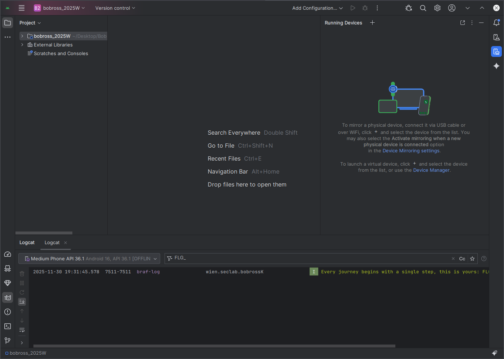
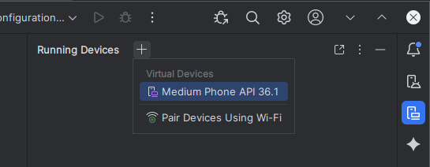
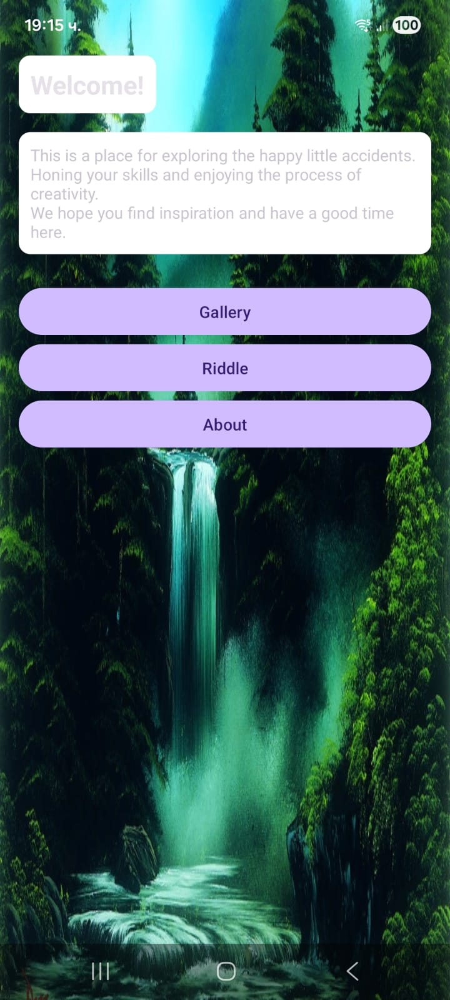
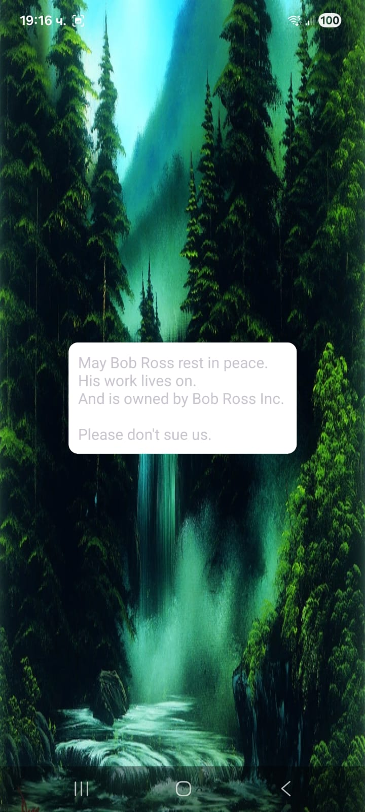

# Bob Ross Pt.1

## Introduction

This challenge focuses on the security analysis and reverse engineering of "The Bob Ross App for Fans." The objective is to dissect the application's internal structure, bypass its obfuscation mechanisms, and retrieve three hidden flags. We approach this as a black-box analysis, starting with only the compiled APK file.

To successfully audit this application, we must configure a standard Android reverse engineering environment. The following tools are required to statically analyze the codebase, inspect compiled resources, and simulate the application's behavior.

## Environment Setup

The analysis relies on 4 primary components. Ensure these are installed and configured in your path before proceeding.

- **Target Application:** `bobross_2025W.apk` - this is the compiled Android application package we will be analyzing.
- **Android Studio & SDK:** Provides the core Android debug tools. Installation: [Android Studio Official Setup](https://developer.android.com/studio/install)
- **JADX-GUI:** A decompiler for converting Dalvik bytecode (`.dex`) into readable Java source code. This is our primary tool for static analysis of the application's logic. Installation: [JADX Repository](https://github.com/skylot/jadx#install)
- **Apktool:** A tool for unpacking and rebuilding Android installation packages. It allows us to view the `AndroidManifest.xml` and Smali code, which provides a lower-level view than JADX. Installation: [Apktool Documentation](https://apktool.org/docs/install)

With the environment established, we proceed to Part 1.

## Decompiling the APK

Before interacting with the application at runtime, we first prepare a decompiled version of the code base for static analysis. For this purpose, we use JADX-GUI to inspect the contents of `bobross_2025W.apk` and then work with the decompiled project inside Android Studio.

### Starting JADX-GUI and Opening the APK

1. Open a terminal window.
2. Start the GUI by running:

```

jadx-gui

```

3. In the JADX-GUI window, choose File → Open File.
4. Navigate to the location of `bobross_2025W.apk` and select it.
5. JADX-GUI automatically decompiles the APK and displays the resulting project structure (packages, classes, and resources) in the left-hand panel.

At this point we can browse Java classes, the `AndroidManifest.xml`, and relevant resources, which will be useful later when we correlate runtime behaviour with specific parts of the code.

### Importing the Decompiled Project into Android Studio

JADX-GUI also allows exporting the decompiled sources as a Gradle-style project, which can then be viewed more comfortably in an IDE.

1. In JADX-GUI, select File → Save All (or the corresponding export option) to generate a source tree for the decompiled application.
2. Open Android Studio and choose File → Open.
3. Select the directory where JADX-GUI saved the decompiled project and confirm.
4. Android Studio indexes the project and presents the decompiled Java sources in its standard project view.

With the decompiled project available in Android Studio, we can cross-reference code while running the original `bobross_2025W.apk` in the emulator, as described in the following section.

## Running the Application

Before delving into the code, we first observe the application's runtime behavior in a controlled environment. The most efficient way to do this is using the Android Emulator integrated within Android Studio.

### Deploying to the Emulator

Launching the target application involves a straightforward process:

1. **Initialize the Device:** In Android Studio, locate the "Running Devices" panel. Click the **+** (plus) icon and select a virtual device from the list (e.g., Medium Phone API 36.1 as shown in the screenshot). This boots up our virtual Android environment.


  | 
:-------------------------:|:-------------------------:

2. **Install the APK:** Once the emulator is running and unlocked, installation is as simple as drag-and-drop. We take the `bobross_2025W.apk` file from our desktop and drag it directly onto the emulator screen. Android Studio automatically handles the installation.

> Quick note: You can also try to transfer the `.apk` file from your PC system to your Android phone, install it, and run the app on your phone as well.

### Initial Observation & Log Analysis

Upon launching "The Bob Ross App for Fans," we expect to be greeted by the first flag immediately. However, the application interface does not display it directly even if you click on the "About" button. This suggests the flag might be generated or logged in the background rather than rendered on the UI.

 | 
:-------------------------:|:-------------------------:


To investigate this, we turn to Logcat, Android's logging system, which captures system and application messages.

1. Open the Logcat tab at the bottom of Android Studio.
2. Ensure the emulator is selected.
3. In the search bar, we filter for keywords like `FLG_PT1`.
4. Success! The search reveals an info log message containing our first secret.

```

2025-11-30 19:31:45.578 7511-7511 braf-log                wien.seclab.bobrossK                           I Every journey begins with a single step, this is yours: FLG_PT1...

```

The application logs a welcome message upon startup to verify successful execution. Inspecting these logs reveals the first flag, which serves as confirmation that our analysis environment is correctly configured.
