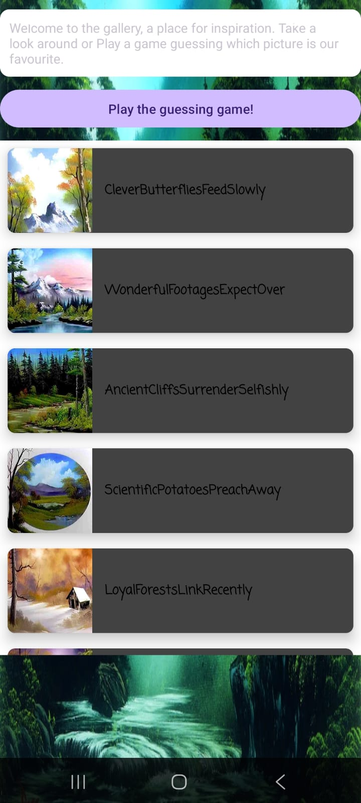
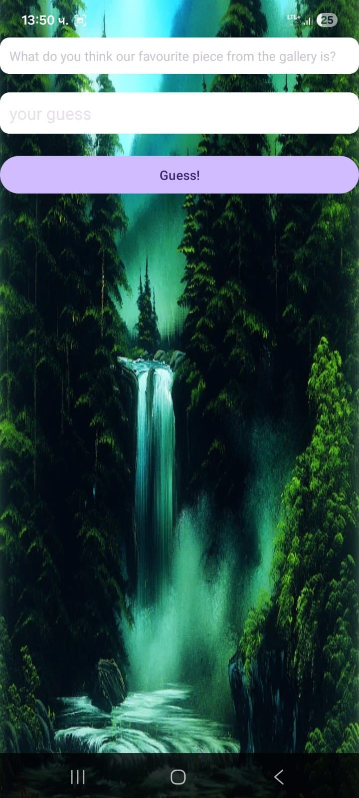
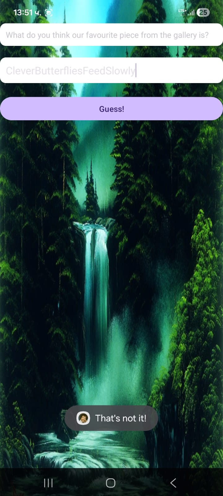
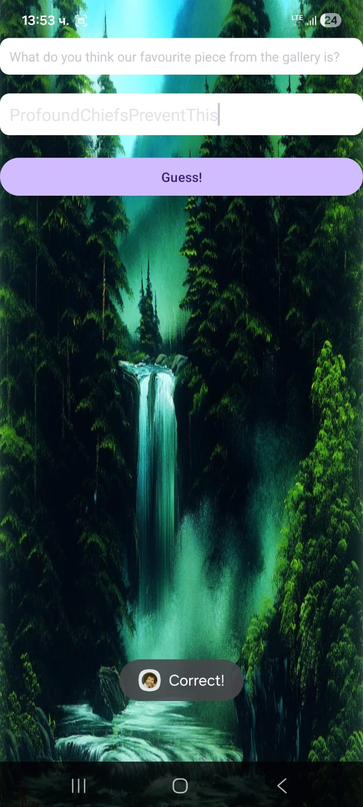

# Bob Ross Pt.2

## Introduction

In the second part of this challenge, we continue working with the same `bobross_2025W.apk` file. The description hints that we must locate the "correct name" of a specific item in the application's gallery to retrieve the flag.

Unlike the first challenge, which involved straightforward log inspection, this part introduces a more sophisticated technique. The application leverages reflection - a mechanism in Java that allows code to dynamically inspect and invoke methods or fields at runtime. When we decompile the application, we observe how Smali bytecode (the low-level assembly representation of Android code) is converted back into Java. This conversion reveals how the application uses reflection to obscure its logic, making static analysis more challenging.

In the following paragraphs, we will demonstrate how to trace reflected method calls, understand the decompiled code structure, and ultimately identify the correct gallery entry to capture the flag.

## Runtime Analysis and Behavior

Before diving into the source code, we first explore the application dynamically to understand its structure and potential attack surface.

Upon launching the application, we are greeted by the main menu, which provides three primary options: "Gallery," "Riddle," and "About."


Navigating to the Gallery section reveals a scrollable list of images, each labeled with a unique, somewhat cryptic name like "CleverButterfliesFeedSlowly" or "WonderfulFootagesExpectOver." This suggests that the names themselves might be significant.




Clicking on any individual image opens a detailed view. Interestingly, underneath the image title, we see a text: `FLG_PT2{your_flag_is_9ac083b0660f}`


This format (`FLG_PT2{...}`) matches the flag pattern we are looking for. Crucially, every image displays this kind of flag, meaning we cannot simply "click and find" the correct flag. The application logic must be validating the "correct" image somewhere else.

Returning to the main gallery view, we notice a prominent button at the top: "Play the guessing game!".

Selecting this option takes us to a new screen where the application asks: "What do you think our favourite piece from the gallery is?". It provides a text input field for our answer.



To test this mechanism, we can try entering the name of the first image we saw, "CleverButterfliesFeedSlowly." As expected, clicking "Guess!" results in a failure message: **"That's not it!"**.



This confirms the challenge logic:

1. There is one specific "favourite" image among the gallery entries.
2. The application validates the name we enter against a hidden correct value.
3. Once we know the name of the correct image we can click on it in the gallery and check for its flag.

Since guessing blindly is inefficient, our next step is to reverse engineer the validation logic to find which image name the application is actually looking for.

## Application Structure and Code Analysis

We start by inspecting the `AndroidManifest.xml`, where all activities of the application are declared. In Android, an Activity represents a single screen with a user interface (Mobile Systems: Android, lecture slides).

The relevant part of the manifest looks as follows:

```xml
<?xml version="1.0" encoding="utf-8"?>
<manifest xmlns:android="http://schemas.android.com/apk/res/android" ... package="wien.seclab.bobrossK" ...>
    <uses-permission android:name="android.permission.INTERNET"/>
    <permission android:name="wien.seclab.bobrossK.DYNAMIC_RECEIVER_NOT_EXPORTED_PERMISSION" android:protectionLevel="signature"/>
    <uses-permission android:name="wien.seclab.bobrossK.DYNAMIC_RECEIVER_NOT_EXPORTED_PERMISSION"/>

    <application ... android:name="wien.seclab.bobrossK.ABobRossAppforFans" ...>
        <activity android:exported="false" android:name="wien.seclab.bobrossK.GuessingActivity"/>
        <activity android:exported="false" android:name="wien.seclab.bobrossK.GalleryActivity"/>
        <activity android:exported="false" android:name="wien.seclab.bobrossK.RiddleActivity"/>
        <activity android:exported="false" android:name="wien.seclab.bobrossK.AboutActivity"/>
        <activity android:exported="false" android:name="wien.seclab.bobrossK.ImageDialog"/>
        <activity android:exported="true" android:name="wien.seclab.bobrossK.MainActivity">
            ...
        </activity>
    </application>
</manifest>
```

For this part of the challenge, the interesting entries are `GalleryActivity` and `GuessingActivity`, since they correspond to the gallery view and the guessing game we observed at runtime.

### GalleryActivity: Loading Gallery Entries

Using JADX, we examine `GalleryActivity`. Two methods are particularly important.

**Loading all gallery content classes**

```java
@Keep
public static ArrayList<Class<GalleryContentCommon>> getGalleryClasses() {
    ArrayList<Class<GalleryContentCommon>> arrayList = new ArrayList<>();
    int i2 = 1;
    while (true) {
        try {
            arrayList.add(Class.forName("wien.seclab.bobrossK.galleries.GalleryContent" + i2));
            i2++;
        } catch (ClassNotFoundException unused) {
            Log.d(MainActivity.TAG, "Yeah this happens when we run out of images at number " + i2);
            return arrayList;
        }
    }
}
```

Piece by piece:

- An empty `ArrayList` is created to hold classes representing gallery items.
- A counter `i2` starts at 1.
- Inside a loop, the code builds class names like `GalleryContent1`, `GalleryContent2`, etc.
- `Class.forName(...)` is used to load each class by name and add it to the list.
- When no further class exists (e.g. `GalleryContent15` doesn't exist), a `ClassNotFoundException` is thrown and caught, and the method returns the list collected so far.

This is how the app discovers all gallery entries without listing them manually.

**Looking up gallery content by name**

```java
@Keep
public static Class<GalleryContentCommon> getGalleryContentByName(String str) {
    ArrayList<Class<GalleryContentCommon>> galleryClasses = getGalleryClasses();
    int size = galleryClasses.size();
    int i2 = 0;
    while (i2 < size) {
        Class<GalleryContentCommon> cls = galleryClasses.get(i2);
        i2++;
        Class<GalleryContentCommon> cls2 = cls;
        String reflectedString = GalleryContentCommon.getReflectedString(cls2, "name");
        if (reflectedString != null && reflectedString.equals(str)) {
            return cls2;
        }
    }
    return null;
}
```

Here:

- `getGalleryClasses()` is called to obtain all gallery item classes.
- The method iterates through each class.
- For each class, it fetches the value of a field called `"name"` via `GalleryContentCommon.getReflectedString(...)`.
- If the value matches the input string `str`, the corresponding class is returned.

### GalleryContent1: Example of a Single Gallery Item

We now look at `GalleryContent1`, which corresponds to the first gallery item ("CleverButterfliesFeedSlowly"):

```java
public class GalleryContent1 extends GalleryContentCommon {
    public static final String image = "painting1";
    public static final String name = "CleverButterfliesFeedSlowly";
    protected static String secret;

    static {
        ABobRossAppforFans aBobRossAppforFans = ABobRossAppforFans.f1713a;
        secret = c.b(2131689557);
    }

    public static String getFlag2() {
        String str;
        String str2 = "";
        try {
            MessageDigest messageDigest = MessageDigest.getInstance("SHA-256");
            messageDigest.update("yesthisone".getBytes("UTF-8"));
            messageDigest.update(name.getBytes("UTF-8"));
            messageDigest.update(secret.getBytes("UTF-8"));
            str2 = GalleryContentCommon.bytesToHex(messageDigest.digest());
            str = str2.toLowerCase();
        } catch (UnsupportedEncodingException | NoSuchAlgorithmException unused) {
            Log.e(MainActivity.TAG, "Yeah this should not happen");
            str = str2;
        }
        return c.e(str, 0, 12, new StringBuilder("FLG_PT2{your_flag_is_"), "}");
    }

    public static String getID() {
        return GalleryContentCommon.computeHash(name, secret);
    }
}
```

**Breakdown:**

Static fields:

```java
public static final String image = "painting1";
public static final String name = "CleverButterfliesFeedSlowly";
protected static String secret;
```

- `image` is an identifier for which image resource should be shown.
- `name` is the display name we see in the gallery and the one we tried in the guessing game.
- `secret` is a per-image secret value, initially uninitialized.

Static initialization block:

```java
static {
    ABobRossAppforFans aBobRossAppforFans = ABobRossAppforFans.f1713a;
    secret = c.b(2131689557);
}
```

- When the class is first loaded, this block runs.
- `c.b(2131689557)` is called to load a string resource from the app's resources (likely from `strings.xml`, explained later) using the numeric ID `2131689557`.
- The result is stored in the static field `secret`.

So for this gallery item we have:

- A known name (`"CleverButterfliesFeedSlowly"`).
- A hidden secret value, loaded from resources via ID `2131689557`.

**Flag computation (`getFlag2`)**

```java
public static String getFlag2() {
    String str;
    String str2 = "";
    try {
        MessageDigest messageDigest = MessageDigest.getInstance("SHA-256");
        messageDigest.update("yesthisone".getBytes("UTF-8"));
        messageDigest.update(name.getBytes("UTF-8"));
        messageDigest.update(secret.getBytes("UTF-8"));
        str2 = GalleryContentCommon.bytesToHex(messageDigest.digest());
        str = str2.toLowerCase();
    } catch (UnsupportedEncodingException | NoSuchAlgorithmException unused) {
        Log.e(MainActivity.TAG, "Yeah this should not happen");
        str = str2;
    }
    return c.e(str, 0, 12, new StringBuilder("FLG_PT2{your_flag_is_"), "}");
}
```

The static method `getFlag2()` is responsible for dynamically generating the placeholder flag string that appears under each gallery image. It does this by creating a unique SHA-256 hash for each image based on its specific properties.

The method operates in several distinct steps:

1. **Initialize the Hash:** It begins by creating a standard `MessageDigest` instance for the SHA-256 algorithm.
2. **Update with Data:** The core of the method is updating the hash with three specific pieces of data, in a fixed order: a hardcoded string `"yesthisone"`, the name of the gallery image (e.g., `"CleverButterfliesFeedSlowly"`), and the secret value loaded from the app's resources.
3. **Compute and Convert:** It computes the final hash and converts the resulting byte array into a lowercase hexadecimal string using the `GalleryContentCommon.bytesToHex()` helper method.
4. **Format the Flag:** Finally, it passes this lowercase hash string to the `c.e()` helper method to construct the final output string, which has the format `FLG_PT2{your_flag_is_...}`.

Let's analyze this helper method `c.e`:

```java
public static String e(String str, int i2, int i3, StringBuilder sb, String str2) {
    sb.append(str.substring(i2, i3));
    sb.append(str2);
    return sb.toString();
}
```

This utility function performs three simple string operations:

1. **Substring extraction:** It takes the input string `str` (our computed SHA-256 hash) and extracts a substring from index `i2` to `i3`. In our case, this is `str.substring(0, 12)`, meaning it takes the first 12 characters of the hex hash.
2. **First Append:** It appends this 12-character substring to the `StringBuilder sb`. The builder was initialized with `"FLG_PT2{your_flag_is_"`.
3. **Second Append:** It appends the string `str2` (which is `"}"`).

So the final result returned by `getFlag2()` is constructed as:

```
"FLG_PT2{your_flag_is_" + [first 12 chars of hash] + "}"
```

This explains the flag format we saw in the gallery (e.g., `FLG_PT2{your_flag_is_9ac083b0660f}`).

**ID computation (`getID`)**

```java
public static String getID() {
    return GalleryContentCommon.computeHash(name, secret);
}
```

This method delegates to `computeHash` in the superclass `GalleryContentCommon`. It passes in the `name` and `secret`. The result is a unique identifier for this gallery item, derived from those two values.

We will use this structure later to see how the guessing game checks whether a provided name is associated with the correct underlying secret.

## GuessingActivity and How a Correct Guess Is Determined

Now we are diving into `GuessingActivity`.

When we press the "Guess!" button, the app calls `checkGuess`, which simply reads the text from the input field and forwards it to `verify`:

```java
@Keep
public void checkGuess(View view) {
    if (verify(((EditText) findViewById(2131230962)).getText().toString())) {
        Toast.makeText(this, "Correct!", 1).show();
    } else {
        Toast.makeText(this, "That's not it!", 1).show();
    }
}
```

So the whole decision whether our answer is correct or not happens inside `verify`.

**Step 1 - Find the gallery entry for the guess**

```java
@Keep
private boolean verify(String str) {
    Log.d(MainActivity.TAG, "got guess: " + str);
    Class<GalleryContentCommon> galleryContentByName = GalleryActivity.getGalleryContentByName(str);
    if (galleryContentByName == null) {
        Log.e(MainActivity.TAG, "no gallery with such name");
        return false;
    }
    ...
}
```

Here the app tries to map the guessed text `str` to one of the `GalleryContentX` classes. If no such class is found, the guess is immediately rejected.

**Step 2 - Ask that class for its ID**

If a matching gallery class exists, the code uses `getID()` from that class:

```java
String str2;
try {
    str2 = (String) galleryContentByName
            .getMethod("getID", null)
            .invoke(null, null);
} catch (IllegalAccessException | NoSuchMethodException | InvocationTargetException unused) {
    Log.e(MainActivity.TAG, "Yeah this should not happen");
    str2 = "";
}
```

So `str2` now holds the ID of the guessed image.

**Step 3 - Compare the ID to the target hash**

```java
return str2.equals(
    "E0ABEF650524206639147EF7EA4644321D39153A16830F5DD57BCE6485282D04"
);
```

The guess is only accepted if the image's ID is exactly this SHA-256 hash.

## How the ID Is Computed (GalleryContentCommon)

Each `GalleryContentX` class does not hardcode this value. Instead, it calls `computeHash` from the common superclass:

```java
@Keep
public static String computeHash(String str, String str2) {
    try {
        MessageDigest messageDigest = MessageDigest.getInstance("SHA-256");
        messageDigest.update(str.getBytes("UTF-8"));   // first input
        messageDigest.update(str2.getBytes("UTF-8"));  // second input
        return bytesToHex(messageDigest.digest());
    } catch (...) {
        Log.e(MainActivity.TAG, "Yeah this should not happen");
        return "";
    }
}
```

`getID()` in each gallery class simply does:

```java
public static String getID() {
    return GalleryContentCommon.computeHash(name, secret);
}
```

So the ID is always:

```
SHA-256( name || secret )
```

where `name` and `secret` are different for every picture.

## Where `name` and `secret` Come From (Example: First Picture)

A little reminder for the structure of `GalleryContent` using `GalleryContent1` as an example. We have in the class:

```java
public static final String name = "CleverButterfliesFeedSlowly";
protected static String secret;

static {
    ABobRossAppforFans aBobRossAppforFans = ABobRossAppforFans.f1713a;
    secret = c.b(2131689557);
}
```

`name` is the label we see in the UI. `secret` is loaded at class initialization with `c.b(2131689557)`.

To compute the same hash as the app, we need two strings for every image: its `name` and its `secret`. The secret is loaded via a numeric resource ID, using the declaration of `c.b()`:

```java
public static String b(int i2) {
    return i1.c.o().getResources().getString(i2);
}
```

At runtime the code only knows the integer ID `2131689557`. To recover the underlying text, we must reverse how Android's resource system works:

The Android documentation explains that each XML resource such as `<string name="SomeName">SomeValue</string>` is compiled into the app's resource table and assigned a unique integer ID, which is what methods like `getResources().getString(id)` use at runtime (see "App resources overview" and "String resources" on Android Developers).

Because of this, the mapping from the original XML to what the code sees is:

```
XML <string name="X">Y</string> → compiled integer ID → runtime getString(ID) == "Y"
```

When reverse engineering, we have to invert that mapping. In a normal Android build, `res/values/public.xml` is used to declare which resources are part of the public API and to keep their IDs stable across versions. When decompiling an APK, however, this file also gives us a convenient text view of the internal mapping between resource names and their numeric IDs. We take advantage of that and use `public.xml` as an ID → name lookup table when recovering string values from calls such as `getString(2131689557)`.

In our case this file is located at `res/values/public.xml`.

Putting both bits of information together, the practical reverse-engineering path becomes (using an example with the first picture):

**1. ID → resource name (`public.xml`)**

`res/values/public.xml` lists public resources with both their ID and name, for example:

```xml
<public type="string"
        name="FabulousPhonesRankSometimes"
        id="0x7f0f0055"/>
```

The number `"0x7f0f0055"` is the hexadecimal value of `2131689557`, the number used for getting the secret of the first picture. This lets us match the numeric ID from the code to the symbolic resource name.

**2. resource name → value (`strings.xml`)**

Using that name we look up the actual text in `res/values/strings.xml`:

```xml
<string name="FabulousPhonesRankSometimes">
    QuickBadgersGatherExpectantly
</string>
```

So in this case, `getString(2131689557)` will return `"QuickBadgersGatherExpectantly"`.

For the first gallery item (`GalleryContent1`) we therefore have:

```
name   = "CleverButterfliesFeedSlowly"
secret = "QuickBadgersGatherExpectantly"
```

and the ID used in `GuessingActivity.verify` is:

```
computeHash(name, secret);
// SHA-256("CleverButterfliesFeedSlowly" + "QuickBadgersGatherExpectantly")
```

When we compute this hash, it does not equal the target hash in `verify`, so this picture is not the favourite one.

We repeat this process for all `GalleryContentX` classes, compute `SHA-256(name + secret)` for each, and compare the result to the hardcoded hash in `verify`. The class whose ID matches that target hash is the correct favourite picture.

At this point it is clear what we must do: for every `GalleryContentX` class we need to recover its `name` and `secret`, compute `SHA-256(name + secret)` and compare the result to the target value from `GuessingActivity`. The class whose ID matches that hash corresponds to the correct gallery entry. Using the algorithm for computing the flag, we can generate the flag automatically with a script.

## Automating the Search for the Favourite Picture

At this point we know everything about the flag generation:

- The secret for each picture is a string loaded via `getString(resourceId)`.
- The ID hash used in `GuessingActivity.verify` is `SHA-256(name || secret)`.
- The flag shown under the image is derived from `SHA-256("yesthisone" || name || secret)`.

What remains is purely mechanical: determine how many gallery items exist and compute the hash for each until one matches the target hash from `GuessingActivity`.

### Determining how many gallery items exist

Instead of relying on JADX's Java view (which sometimes fails to show all classes), it is more reliable to use the smali code produced by Apktool. In the decompiled APK (Apktool output), under:

```
smali/wien/seclab/bobrossK/galleries/
```

we can count how many `GalleryContentX.smali` files exist. In this challenge there are 256 such files, which matches the description in the task text.

Working with the smali files has two advantages:

- We see every class, regardless of any decompiler issues.
- We can parse them as plain text to extract exactly the information we need.

### What we extract from each smali class

From each `GalleryContentX.smali`, we only need two pieces of data:

**The gallery name** (used as `name` in the hash):

```
.field public static final name:Ljava/lang/String; = "CleverButterfliesFeedSlowly"
```

In the decompiled Java, this appears as:

```java
public static final String name = "CleverButterfliesFeedSlowly";
```

**The resource ID of the secret string:**

```
const v0, 0x7f0f0055
invoke-static {v0}, L.../c;->b(I)Ljava/lang/String;
```

In the Java code this shows up as:

```java
secret = c.b(2131689557);
```

The script searches each smali file for:

- A line that assigns the `name` field (`name:Ljava/lang/String; = "..."`).
- A line that loads a constant with the pattern `const vX, 0x...` (the hex ID).

These two strings (`name` and hex ID) are all we need from each class.

### Preparing the resource mapping

As discussed earlier, `public.xml` and `strings.xml` are used together to translate from numeric ID to actual secret value. To make the script simpler and avoid parsing large XML files repeatedly, we pre-extract the 256 relevant entries into two plain text files:

- **`secretKeys.txt`** - a cleaned subset of `public.xml` that only contains the 256 `<public type="string" ...>` entries for the gallery secrets. Each line looks like:
  ```
  <public type="string" name="FabulousPhonesRankSometimes" id="0x7f0f0055"/>
  ```
- **`secretValues.txt`** - a cleaned subset of `strings.xml` that only contains the 256 `<string>` entries we care about:
  ```
  <string name="FabulousPhonesRankSometimes">QuickBadgersGatherExpectantly</string>
  ```
- **`galleries`** - a copied folder of the original galleries in the decompiled directory of the app, where we can go into and access directly the smali file of every picture.

### Solver script (`SolvePart2.java`): setup and loading data

Now it is time to build the script whose goal is to find the correct image, compute the ID of every picture, and after finding the correct one, compute its flag.

```java
import java.io.BufferedReader;
import java.io.File;
import java.io.FileReader;
import java.io.IOException;
import java.nio.charset.StandardCharsets;
import java.nio.file.Files;
import java.security.MessageDigest;
import java.util.HashMap;
import java.util.Map;
import java.util.regex.Matcher;
import java.util.regex.Pattern;
```

- `File`, `FileReader`, `BufferedReader`, `Files` and `StandardCharsets` are used to read text files from disk (smali files and the two mapping files).
- `MessageDigest` is used to compute SHA-256 hashes.
- `Pattern` and `Matcher` are used to search for specific patterns in text using regular expressions (for example, the `name` field and the resource ID inside each smali file).

Then comes the configuration block and some helper constants:

```java
public class SolvePart2 {

    // ================= CONFIGURATION =================
    private static final String GALLERIES_DIR = "galleries";
    private static final String KEYS_FILE = "secretKeys.txt";      // public.xml (ID -> Name)
    private static final String VALUES_FILE = "secretValues.txt";  // strings.xml (Name -> Value)

    // Target hash from GuessingActivity.verify()
    private static final String TARGET_HASH =
            "E0ABEF650524206639147EF7EA4644321D39153A16830F5DD57BCE6485282D04"
                    .toLowerCase();
    // =================================================

    private static final char[] HEX_ARRAY = "0123456789ABCDEF".toCharArray();
```

- `GALLERIES_DIR` is the path to the folder that contains all `GalleryContentX.smali` files (copied from the Apktool output).
- `KEYS_FILE` is a pre-extracted text file based on `public.xml`, containing only the `<public type="string" ...>` lines relevant for the secrets (ID → name).
- `VALUES_FILE` is a pre-extracted text file based on `strings.xml`, containing only the `<string ...>` lines for those names (name → value).
- `TARGET_HASH` is the SHA-256 value from `GuessingActivity.verify()`, converted to lowercase to make comparisons easier.
- `HEX_ARRAY` is a lookup table used later to convert raw bytes into a hexadecimal string.

The main method wires everything together and loads the data:

```java
    public static void main(String[] args) {
        try {
            Map<String, String> idToName = loadKeys(KEYS_FILE);
            Map<String, String> nameToValue = loadValues(VALUES_FILE);

            File dir = new File(GALLERIES_DIR);
            if (!dir.exists()) {
                System.out.println("[!] Directory not found: " + dir.getAbsolutePath());
                return;
            }

            System.out.println("[*] Scanning for match to hash: " + TARGET_HASH);
            scanAndPrint(dir, idToName, nameToValue);

        } catch (Exception e) {
            e.printStackTrace();
        }
    }
```

- `loadKeys` reads `secretKeys.txt` and builds a map from hex ID (`0x7f0f0055`) to resource name (`FabulousPhonesRankSometimes`).
- `loadValues` reads `secretValues.txt` and builds a map from resource name to the actual secret string (`QuickBadgersGatherExpectantly`).
- The script then checks that the `galleries` directory exists and calls `scanAndPrint` to start walking through all `.smali` files using those two maps.

Finally, these two helper functions handle loading and parsing the mapping files.

**Loading IDs from `secretKeys.txt` (ID → name):**

```java
    // Load public.xml (ID -> Name)
    private static Map<String, String> loadKeys(String filepath) throws IOException {
        Map<String, String> map = new HashMap<>();
        File f = new File(filepath);
        if (!f.exists()) return map;

        try (BufferedReader br = new BufferedReader(new FileReader(f))) {
            String line;
            Pattern p = Pattern.compile("name=\"([^\"]+)\"[^>]*id=\"(0x[0-9a-fA-F]+)\"");
            while ((line = br.readLine()) != null) {
                Matcher m = p.matcher(line);
                if (m.find()) {
                    map.put(m.group(2).toLowerCase(), m.group(1));
                }
            }
        }
        System.out.println("[*] Loaded " + map.size() + " IDs from " + filepath);
        return map;
    }
```

For each line, the regex extracts:

- `m.group(1)` - the resource name (e.g. `FabulousPhonesRankSometimes`),
- `m.group(2)` - the hex ID (e.g. `0x7f0f0055`).

We store them as `id → name` in a `HashMap`.

**Loading values from `secretValues.txt` (name → secret value):**

```java
    // Load strings.xml (Name -> Value)
    private static Map<String, String> loadValues(String filepath) throws IOException {
        Map<String, String> map = new HashMap<>();
        File f = new File(filepath);
        if (!f.exists()) return map;

        try (BufferedReader br = new BufferedReader(new FileReader(f))) {
            String line;
            Pattern p = Pattern.compile("<string name=\"([^\"]+)\">([^<]+)</string>");
            while ((line = br.readLine()) != null) {
                Matcher m = p.matcher(line);
                if (m.find()) {
                    map.put(m.group(1), m.group(2));
                }
            }
        }
        System.out.println("[*] Loaded " + map.size() + " Values from " + filepath);
        return map;
    }
}
```

Here the regex extracts:

- `m.group(1)` - the string name (`FabulousPhonesRankSometimes`),
- `m.group(2)` - the actual secret text (`QuickBadgersGatherExpectantly`).

We store them as `name → secret` in another `HashMap`.

**`scanAndPrint`**

This function recursively walks through the `galleries` directory (and its subdirectories), looking for `.smali` files. For each `.smali` file it finds, it calls `processFile`.

```java
private static void scanAndPrint(File dir,
                                 Map<String, String> idToName,
                                 Map<String, String> nameToValue) {
    File[] files = dir.listFiles();
    if (files == null) return;

    for (File file : files) {
        if (file.isDirectory()) {
            scanAndPrint(file, idToName, nameToValue); // Recursive call for subdirectories
        } else if (file.getName().endsWith(".smali")) {
            processFile(file, idToName, nameToValue);
        }
    }
}
```

It uses `file.isDirectory()` to handle subdirectories recursively (in our case there is no need for recursion, since we are using a copied version of the `galleries` folder). It only processes files ending with `.smali` (the gallery class definitions).

**`processFile`**

This is the core function that works on each `.smali` file. Its main steps:

1. **Read the file's content:**

```java
String content = new String(Files.readAllBytes(file.toPath()), StandardCharsets.UTF_8);
```

2. **Extract the gallery name:**

```java
Pattern nameP = Pattern.compile("name:Ljava/lang/String;\\s*=\\s*\"([^\"]+)\"");
Matcher nameM = nameP.matcher(content);
if (!nameM.find()) return;
String className = nameM.group(1);
```

`className` now holds the "name" string seen by the app for this gallery entry.

3. **Extract the hex resource ID:**

```java
Pattern idP = Pattern.compile("const\\s+[vp]\\d+,\\s*(0x[0-9a-fA-F]+)");
Matcher idM = idP.matcher(content);
if (!idM.find()) return;
String hexId = idM.group(1).toLowerCase();
```

`hexId` is the hex string like `0x7f0f0055` used for the secret.

4. **Look up the secret value:**

```java
if (idToName.containsKey(hexId)) {
    String resName = idToName.get(hexId);
    if (nameToValue.containsKey(resName)) {
        String secretValue = nameToValue.get(resName);
        ...
    }
}
```

`secretValue` is the actual secret string.

5. **Compute the ID hash and flag:**

```java
String hash = computeIdHash(className, secretValue);
if (hash.equals(TARGET_HASH)) {
  String flag = computeFlag(className, secretValue);
  // Print match details
}
```

Only if the hash equals the target, print all relevant information including the gallery name, secret, and correctly formatted flag.

**`computeIdHash`**

Computes the hash as in `GalleryContentCommon.computeHash(name, secret)`:

```java
private static String computeIdHash(String name, String secret) {
    try {
        MessageDigest md = MessageDigest.getInstance("SHA-256");
        md.update(name.getBytes("UTF-8"));
        md.update(secret.getBytes("UTF-8"));
        byte[] digest = md.digest();
        return bytesToHex(digest).toLowerCase();
    } catch (Exception e) {
        return "";
    }
}
```

**`computeFlag`**

Computes the flag as the app does for displaying under the image:

```java
private static String computeFlag(String name, String secret) {
    try {
        MessageDigest md = MessageDigest.getInstance("SHA-256");
        md.update("yesthisone".getBytes("UTF-8"));
        md.update(name.getBytes("UTF-8"));
        md.update(secret.getBytes("UTF-8"));
        String full = bytesToHex(md.digest()).toLowerCase();
        String first12 = full.substring(0, 12);
        return "FLG_PT2{your_flag_is_" + first12 + "}";
    } catch (Exception e) {
        return "";
    }
}
```

**`bytesToHex`**

Turns any byte array (like a SHA-256 hash) into its hexadecimal string representation:

```java
public static String bytesToHex(byte[] bArr) {
    char[] cArr = new char[bArr.length * 2];
    for (int i2 = 0; i2 < bArr.length; i2++) {
        byte b2 = bArr[i2];
        int i3 = i2 * 2;
        char[] cArr2 = HEX_ARRAY;
        cArr[i3]     = cArr2[(b2 & 0xFF) >>> 4];
        cArr[i3 + 1] = cArr2[b2 & 0x0F];
    }
    return new String(cArr);
}
```

Each helper has a single job, and the control flow is easy to follow:

- `scanAndPrint` walks all files.
- `processFile` parses and checks each one.
- `computeIdHash` and `computeFlag` do the cryptographic work.
- Simple lookup maps connect resource IDs and secrets to the actual values.

## Summary of the Approach

1. Look in the manifest to see all the activities. Here we retrieve as useful `GuessingActivity` and `GalleryActivity`.
2. In `GalleryActivity`, we see `GalleryContentCommon` objects are used to show the pictures.
3. Locate the gallery classes (`GalleryContent1`, `GalleryContent2`, …) and saw: each one has a static `name` string; each one loads a `secret` via `c.b(<intID>)`.
4. Check `GuessingActivity.verify()` and how it checks guesses via `getID()` against a hardcoded SHA-256 hash.
5. Analyse `GalleryContentCommon.computeHash(name, secret)` and `getFlag2()`.
6. Confirmed by reading the code that: the image ID = `SHA-256(name || secret)`, and the flag is derived from `SHA-256("yesthisone" || name || secret)` (first 12 hex chars, formatted as `FLG_PT2{...}`).
7. Followed `c.b(int)` into the helper that calls `getApplicationContext().getResources().getString(id)`, confirming `secret` comes from Android string resources.
8. Switched to the Apktool output to avoid JADX issues and: retrieved the count of the `GalleryContentX.smali` files under `smali/.../galleries/` (256 entries); opened a few `.smali` files to verify where `name` and the `const 0x...` secret ID appear.
9. Looked into `res/values/public.xml` to map integer/hex IDs → string resource names, then into `res/values/strings.xml` to map string resource names → actual secret values.
10. Extracted the 256 relevant `<public ...>` lines into `secretKeys.txt` and the 256 `<string ...>` lines into `secretValues.txt` to make parsing easier.
11. Wrote the `SolvePart2.java` script that loads the mapping files, scans the `galleries/` folder for `GalleryContentX.smali` files, parses out `name` and the hex ID for each, resolves the secret, computes the ID hash and compares it to the target, and computes the flag when a match is found.
12. Ran the script to automatically find which gallery picture matches the target hash and to print its final flag.

Here is the output of the script, after it is compiled and run:

```
[*] Loaded 256 IDs from secretKeys.txt
[*] Loaded 256 Values from secretValues.txt
[*] Scanning for match to hash: e0abef650524206639147ef7ea4644321d39153a16830f5dd57bce6485282d04

################ MATCH FOUND ################
File:         GalleryContent148.smali
Class Name:   ProfoundChiefsPreventThis
Secret Value: BrokenBrainsBreachGloriously
Hash (ID):    e0abef650524206639147ef7ea4644321d39153a16830f5dd57bce6485282d04
Flag:         FLG_PT2{your_flag_is_96d7a9******}
#############################################
```

*(Note: The flag is intentionally censored with `*`.)*

And if you are curious, you can try to write in the guess field the name of the picture "ProfoundChiefsPreventThis" and you will see that is the correct one.


