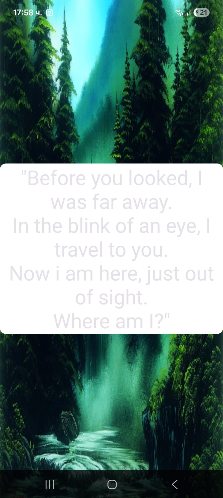

# Bob Ross Pt.3

## Introduction

For the third Bob Ross challenge we are again working with the same APK, but this time the task description gives us essentially no technical hint beyond "Riddle me this: What's the flag?" and the usual flag format. There is no obvious input field, no log messages, and no static string that looks like a solution. The only clue comes from the category: this part is about dynamic code loading / dynamic analysis, not about pulling the answer straight out of the original DEX.

The core idea behind the solve is therefore: instead of looking only at the code that ships with the APK, we must understand how the app fetches additional code at **runtime**, how that code is verified and decrypted, and how it is finally executed to set the hidden flag.

## Riddle Me This, Batman

The task text for part 3 does not give any real technical hint beyond the usual flag format, but the wording "Riddle me this: What's the flag?" clearly points towards the **Riddle** button in the app's main menu. When we tap on *Riddle*, the application shows a full-screen Bob Ross painting with an overlaid text box that contains the riddle.



There is no input field, no obvious interaction, and at this point the riddle text itself does not directly suggest how to obtain the flag. To confirm that this screen is backed by a dedicated activity, we inspect the `AndroidManifest.xml`. Among the declared activities we find an entry for `RiddleActivity`, which is the logical starting point for further reverse engineering:

```xml
<application ... android:name="wien.seclab.bobrossK.ABobRossAppforFans" ... >
    <activity android:exported="false"
              android:name="wien.seclab.bobrossK.GuessingActivity"/>
    <activity android:exported="false"
              android:name="wien.seclab.bobrossK.GalleryActivity"/>
    <activity android:exported="false"
              android:name="wien.seclab.bobrossK.RiddleActivity"/>
    <activity android:exported="false"
              android:name="wien.seclab.bobrossK.AboutActivity"/>
    <activity android:exported="false"
              android:name="wien.seclab.bobrossK.ImageDialog"/>
    <activity android:exported="true"
              android:name="wien.seclab.bobrossK.MainActivity">
        <intent-filter>
            <action android:name="android.intent.action.MAIN"/>
            <category android:name="android.intent.category.LAUNCHER"/>
        </intent-filter>
    </activity>
    ...
</application>
```

## RiddleActivity in JADX

For part 3, the analysis is done directly on the APK opened in JADX, without first converting to smali. This is enough to see all the important pieces of `RiddleActivity` and the dynamic behavior behind the riddle screen.

The class starts by defining two static fields:

```java
public class RiddleActivity extends AppCompatActivity {

    public static final MutableLiveData f1718a = new MutableLiveData();
    public static final MutableLiveData f1719b = new MutableLiveData();
```

Both are instances of `MutableLiveData`, which is just a writable version of Android's `LiveData` type. `LiveData` is a lifecycle-aware observable holder class: you can post values into it, and any registered UI observers will automatically receive updates on the main thread and refresh the view. In our case:

- `f1718a` is used for the riddle text.
- `f1719b` is used to hold the (hidden) flag value.

That intention is made explicit by the helper methods:

```java
@Keep
public static String getFlag() {
    return (String) f1719b.getValue();
}

@Keep
public static void setFlag(String str) {
    f1719b.postValue(str);
}

@Keep
public static void setText(String str) {
    f1718a.postValue(str);
}
```

`setText` and `setFlag` do not compute anything; they simply push new values into the two `MutableLiveData` instances. The interesting part is who will call these methods later.

Inside `onCreate` the activity wires the `LiveData` to the UI and sets up the network logic:

```java
@Override
public final void onCreate(Bundle bundle) {
    super.onCreate(bundle);
    setContentView(R.layout.activity_riddle);
    setTitle("The Riddle");

    f1718a.observe(this, new Observer() {
        @Override
        public void onChanged(Object obj) {
            String str = (String) obj;
            if (str != null) {
                ((TextView) findViewById(R.id.riddleTextView)).setText(str);
            }
        }
    });
```

Here, `observe(this, ...)` registers an observer that updates the `TextView` whenever `setText(...)` posts a new string. There is no code here that ever calls `setText` or `setFlag` itself, which already hints that another component will do that.

The next part of `onCreate` clearly shows that the riddle logic involves a remote resource:

```java
    String str = "https://bothub.uber.space/class";
    Context applicationContext = getApplicationContext();
    t tVar = new t(new s());
    LinkedHashMap linkedHashMap = new LinkedHashMap();
    ArrayList arrayList = new ArrayList(20);

    if (k.R("https://bothub.uber.space/class", "ws:", true)) {
        str = "http:".concat("ps://bothub.uber.space/class");
    } else if (k.R("https://bothub.uber.space/class", "wss:", true)) {
        str = "https:".concat("s://bothub.uber.space/class");
    }

    p pVar = new p();
    pVar.c(null, str);
    q a2 = pVar.a();
    o oVar = new o((String[]) arrayList.toArray(new String[0]));
    ...
    i iVar = new i(tVar, new v(a2, "GET", oVar, null, unmodifiableMap));
    a aVar = new a(applicationContext);
    ...
    e1.f fVar3 = new e1.f(iVar, aVar);
    ...
    lVar.e();
}
```

From this snippet alone we can already say:

- The app prepares a GET request to `https://bothub.uber.space/class`. The `t`, `p`, `q`, `o`, `v`, `i` classes are part of an HTTP client wrapper (similar in style to OkHttp), constructing a request object `iVar`.
- It retrieves the application context with `getApplicationContext()` and passes it into a new instance of `wien.seclab.bobrossK.a`:

```java
a aVar = new a(applicationContext);
```

The application context is a special `Context` giving access to app-wide features such as internal storage, package information, and the app's class loader, which are all prerequisites for dynamic code loading.

The HTTP request and the callback are then bound together in `new e1.f(iVar, aVar)` and scheduled with `lVar.e()`. This shows that all interesting work after the HTTP response arrives is delegated to class `a`, which uses the application context.

So: from `RiddleActivity` we can already see that there is a network request to a remote URL, that the riddle text and flag are pushed via `LiveData`, and that the actual logic for handling the HTTP response (including any decryption or dynamic loading) lives in `wien.seclab.bobrossK.a`. The exact details of downloading and decrypting the JAR/DEX, and how `setText`/`setFlag` are called, become clear only when we inspect that `a` class in the next section.

## Dynamic Loader Callback `a`

The class `wien.seclab.bobrossK.a` is the callback that is executed when the HTTP request started in `RiddleActivity` finishes. Its constructor just stores the application `Context`:

```java
public final class a implements ClickListener {
    public final /* synthetic */ Context f1720a;

    public /* synthetic */ a(Context context) {
        this.f1720a = context;
    }
```

### 1. Handling the HTTP response

The method `a(x xVar)` is called with the HTTP response object:

```java
public void a(x xVar) {
    int i2 = xVar.f192e;
    if (200 > i2 || i2 >= 300) {
        Log.e(MainActivity.TAG, "Failed to download remote resource error " + i2);
        return;
    }
    y yVar = xVar.f195h;
    if (yVar != null) {
        Context context = this.f1720a;
        File file = new File(context.getFilesDir(), "data.jar");
        long a2 = yVar.a();          // Content-Length
        ...
        h b2 = yVar.b();             // body stream
        byte[] f2 = b2.f();          // read all bytes
        ...
```

- It first checks the HTTP status code and aborts if it is not 2xx.
- It then reads the entire response body into `f2` and sanity-checks that its length matches the Content-Length header.
- The output file is prepared as `data.jar` in the app's internal files directory (`context.getFilesDir()`), which is only accessible via the `Context`.

Up to this point you can already see that the response is treated as some binary blob that will be written as a JAR-like file.

### 2. Deriving the AES key from the app's certificate

Next comes the key-derivation logic:

```java
byte[] digest = MessageDigest.getInstance("SHA-256").digest(
    ((X509Certificate) CertificateFactory.getInstance("X509")
        .generateCertificate(new ByteArrayInputStream(
            context.getPackageManager()
                   .getPackageInfo(context.getPackageName(), 134217728)
                   .signingInfo
                   .getApkContentsSigners()[0]
                   .toByteArray()
        ))).getEncoded());

StringBuilder sb = new StringBuilder();
for (byte b3 : digest) {
    sb.append(String.format("%02x", Byte.valueOf(b3)));
}
str = String.valueOf(sb);   // hex string of SHA-256(cert)
```

- It asks the `PackageManager` (via the context) for this app's package info and signing certificate.
- It converts the certificate to bytes, computes a SHA-256 digest, and formats it as a lowercase hex string `str`.

This ties any later cryptography directly to the app's own signing key.

### 3. AES decryption of the downloaded blob

The digest string is then turned into an AES key and used to decrypt the response:

```java
SecretKeySpec secretKeySpec =
    new SecretKeySpec(Arrays.copyOf(str.getBytes(), 16), "AES");
Cipher cipher = Cipher.getInstance("AES/CBC/PKCS5Padding");
cipher.init(2, secretKeySpec, new IvParameterSpec(new byte[16]));
FileOutputStream fileOutputStream = new FileOutputStream(file);
file.setReadOnly();
fileOutputStream.write(cipher.doFinal(f2));
```

- It takes the first 16 bytes of `str.getBytes()` and uses them as an AES key (`SecretKeySpec`).
- The cipher mode is `AES/CBC/PKCS5Padding` with an IV of 16 zero bytes.
- The encrypted body `f2` is decrypted and the plaintext is written into `data.jar`, which is then marked read-only (a requirement for safe dynamic loading on newer Android versions).

So the HTTP response is actually an AES-encrypted JAR/DEX, and the key is deterministically derived from the app's signing certificate via SHA-256.

### 4. Dynamic loading and flag injection

Finally, the decrypted JAR is loaded and used to set the riddle text and flag:

```java
Class<?> loadClass = new DexClassLoader(
        file.getAbsolutePath(),
        file.getParentFile().getAbsolutePath(),
        null,
        context.getClassLoader()
).loadClass("wien.seclab.secret");
file.delete();
loadClass.getMethod("setFlagSecret", Class.class).invoke(null, RiddleActivity.class);
loadClass.getMethod("setTextSecret", Class.class).invoke(null, RiddleActivity.class);
```

- `DexClassLoader` loads the class `wien.seclab.secret` from `data.jar` using the app's class loader.
- The temporary JAR file is deleted afterward to hide the payload on disk.
- Two static methods of the loaded class are invoked via reflection: `setFlagSecret(RiddleActivity.class)` and `setTextSecret(RiddleActivity.class)`.

Inside `wien.seclab.secret`, these methods use the passed `RiddleActivity.class` to call the public static methods `RiddleActivity.setFlag(...)` and `RiddleActivity.setText(...)`. That is why those methods are annotated with `@Keep` in `RiddleActivity` - they must remain accessible and not be removed or renamed by the optimizer.

### 5. Where the HTTP logic is seen

From `RiddleActivity` alone you can see that a GET request to `https://bothub.uber.space/class` is made and that a callback object `new a(applicationContext)` is registered, so you already know "the riddle involves some remote resource". The detailed behavior - saving the body, deriving the AES key from the signing certificate, decrypting to `data.jar`, dynamically loading `wien.seclab.secret` and calling its methods - is only visible once you inspect this `a` class.

In other words:

- `RiddleActivity` tells you there is an HTTP request and a delegate.
- `a` tells you what is done with the response: decrypt a JAR using a key from the app's certificate and dynamically load the code that finally sets the part-3 flag.

## Downloading the Encrypted DEX

From `RiddleActivity` and class `a` it is clear that the app performs an HTTP GET to `https://bothub.uber.space/class` and treats the response body as a binary blob that gets decrypted and written to `data.jar`, which is then loaded via `DexClassLoader` as class `wien.seclab.secret`. Because we see this URL and the decryption code, we can simply download the same payload ourselves, for example:

```
curl https://bothub.uber.space/class -o class.dex
```

or just by copying the link and pasting it into the URL field in your favourite browser.

Opening `class.dex` in a hex editor (or with `strings`) shows only random-looking bytes: this is the AES-encrypted form of the JAR/DEX the app expects. There is no readable Java class name or ZIP header, which matches the fact that the app decrypts `f2` before loading it.

## Why Decryption Should Work

The decompiled code in `a` shows exactly how the app turns the downloaded bytes into a valid JAR:

**Key derivation**

- It reads the app's own signing certificate via `PackageManager` and `signingInfo`.
- It computes a SHA-256 hash of that certificate.
- It formats the hash as a lowercase hex string and then takes the first 16 bytes of that string as the AES key.

This is deterministic: for a given signed APK, everyone who has the certificate (or its SHA-256 fingerprint from `keytool`) will derive the same 128-bit key. Symmetric ciphers use the same key for encryption and decryption, so if the server encrypted the payload with that key, reproducing the key locally guarantees that decryption will succeed.

**Cipher mode and IV**

- The cipher mode is `AES/CBC/PKCS5Padding`.
- The IV is 16 zero bytes: `new IvParameterSpec(new byte[16])`.

In CBC mode, decryption is uniquely determined by the ciphertext, key and IV:

\[ P_1 = D_K(C_1) \oplus IV \]
\[ P_i = D_K(C_i) \oplus C_{i-1} \quad \text{for } i > 1 \]

Because we know all three values (ciphertext from the server, key from the certificate hash, IV = all zeros), running AES-CBC with PKCS5/PKCS7 unpadding will recover exactly the same plaintext that the app writes into `data.jar`.

**Why CBC with zero IV is "good enough" here**

From a security perspective, using a constant IV in CBC is not ideal because encrypting two messages with the same key and IV can leak patterns in equal prefixes. For our purpose as attackers, this weakness does not hurt us - in fact, it helps: a fixed IV makes the scheme even easier to reproduce, since we do not have to recover a random IV from headers or metadata. As long as we match the mode (`AES/CBC/PKCS5Padding`), key bytes, and IV = 16 × `0x00`, our decryption will always yield the same plaintext.

**Evidence that the plaintext is a valid JAR/DEX**

Immediately after decryption, the app does:

```java
FileOutputStream fileOutputStream = new FileOutputStream(file);
fileOutputStream.write(cipher.doFinal(f2));
...
Class<?> loadClass = new DexClassLoader(
    file.getAbsolutePath(),
    file.getParentFile().getAbsolutePath(),
    null,
    context.getClassLoader()
).loadClass("wien.seclab.secret");
```

`DexClassLoader` can only load valid `.dex` files or a JAR/ZIP containing DEX files. If the decryption were wrong (wrong key, wrong mode, wrong IV), this call would fail with a `ClassNotFoundException` or verification error, and the catch block would log "Failed to run object". Because the challenge app actually runs and shows the riddle, we know that in the intended execution this decryption succeeds, so copying the same logic offline is guaranteed to work too.

### Putting it together

So the reasoning is:

1. The URL gives us the encrypted payload.
2. The decompiled code tells us exactly which symmetric cipher, which key, and which IV are used.
3. Symmetric cryptography guarantees that using the same parameters on the same ciphertext yields the original plaintext.
4. The app's own successful dynamic loading via `DexClassLoader` is proof that the decrypted plaintext is a valid JAR/DEX.

Therefore, downloading `https://bothub.uber.space/class`, deriving the AES key from the APK's signing certificate, and running AES/CBC/PKCS5 decryption with a zero IV is guaranteed to reconstruct the same `data.jar` that the app uses - allowing inspection of `wien.seclab.secret` and extraction of the third flag.

## Key Derivation and Decryption Script

### What is an APK signature?

Every Android APK must be digitally signed before it can be installed on a device. The signature serves two main purposes:

- **Integrity:** It ensures that the APK has not been tampered with or modified after it was signed. Any change to the app's code or resources invalidates the signature.
- **Identity:** It identifies the developer or organization that created the app. Android uses the signature to determine if two apps come from the same source (for example, to allow them to share data via signature-protected permissions).

The signing process creates a cryptographic hash (commonly SHA-256) of the certificate used to sign the APK. This hash, known as the fingerprint, uniquely identifies the certificate and is what Android checks during installation and updates.

### Inspecting the signature in JADX

When opening the APK in JADX, the tool shows the APK's metadata including its certificate fingerprints. You can find this by navigating to the certificate details or checking the signature panel. For this APK, the relevant line is:

```
SHA-256 Fingerprint: B4 F0 17 16 97 DF DB E8 56 0C 2B 16 5F 59 B6 62 CB 67 19 75 52 DC A6 61 02 0B 76 A6 A3 93 BC 36
```

This SHA-256 string is the same value that the app computes at runtime in `wien.seclab.bobrossK.a` and uses to derive the AES decryption key. With this fingerprint and the downloaded `class.dex` file, we can now build a Python script to reproduce the decryption offline.

### The Solver Script (`solve.py`)

**Imports and configuration**

```python
import hashlib
from Crypto.Cipher import AES
import binascii

SIGNATURE_SHA256 = "B4 F0 17 16 97 DF DB E8 56 0C 2B 16 5F 59 B6 62 CB 67 19 75 52 DC A6 61 02 0B 76 A6 A3 93 BC 36"
```

We import the necessary libraries for AES decryption and define the SHA-256 fingerprint copied from JADX. This fingerprint is the raw output from the certificate hash and is formatted with spaces for readability.

**Part 1: Cleaning the signature string**

```python
    # 1. Clean the signature (remove spaces/colons and make lowercase)
    # The app code: String.format("%02x", ...) produces lowercase hex
    clean_sig = SIGNATURE_SHA256.replace(":", "").replace(" ", "").lower()
```

The app's Java code formats the SHA-256 digest as a lowercase hexadecimal string without any separators. Here we take the fingerprint (which has spaces), remove all non-hex characters, and convert it to lowercase to match the app's format. After this step, `clean_sig` is a continuous 64-character hex string: `b4f01716...bc36`.

**Part 2: Deriving the AES key**

```python
    # 2. Derive the key (First 16 chars of the hex string)
    # The app code: Arrays.copyOf(strValueOf.getBytes(), 16)
    key_string = clean_sig[:16]
    key_bytes = key_string.encode('utf-8')
    print(f"Key found: {key_string}")
```

The app takes the first 16 characters of the hex string (not bytes), encodes them as UTF-8, and uses those bytes as the AES key. In Python, `clean_sig[:16]` gives us `"b4f01716...db"` (16 chars), and `.encode('utf-8')` turns it into 16 bytes. This is the 128-bit AES key.

**Part 3: Setting up the AES cipher**

```python
    # 3. Setup AES (Mode: CBC, IV: 0000...)
    iv = b'\x00' * 16
    cipher = AES.new(key_bytes, AES.MODE_CBC, iv)
```

From the decompiled code we know the cipher is `AES/CBC/PKCS5Padding` with an IV of 16 zero bytes. In Python, `AES.new(key_bytes, AES.MODE_CBC, iv)` creates the same cipher configuration. The PKCS5Padding is handled manually after decryption (see Part 5).

**Part 4: Reading the encrypted file**

```python
    # 4. Read the encrypted file
    try:
        with open("class.dex", "rb") as f:
            encrypted_data = f.read()
    except FileNotFoundError:
        print("ERROR: Could not find 'class.dex'. Run the curl command first!")
        return
```

We expect `class.dex` to be the file downloaded from `https://bothub.uber.space/class`. This is the encrypted payload that the app receives over HTTP. We read it as raw bytes.

**Part 5: Decrypting and removing padding**

```python
    # 5. Decrypt
    try:
        decrypted_data = cipher.decrypt(encrypted_data)
        # Remove Padding (PKCS5)
        padding_len = decrypted_data[-1]
        decrypted_data = decrypted_data[:-padding_len]
```

The `decrypt()` call returns the plaintext with PKCS5 padding still attached. In PKCS5/PKCS7, the last byte of the plaintext indicates how many padding bytes were added. We read that value and strip that many bytes from the end.

**Part 6: Saving the decrypted JAR**

```python
        # 6. Save the result
        with open("decrypted.jar", "wb") as f:
            f.write(decrypted_data)
        print("\nSUCCESS! Created 'decrypted.jar'.")
        print("ACTION: Drag 'decrypted.jar' into JADX now!")
    except Exception as e:
        print(f"Decryption Failed: {e}")
```

We write the plaintext to `decrypted.jar`. If everything was correct, this is the same JAR that `DexClassLoader` would load at runtime. We can now open `decrypted.jar` in JADX to inspect the `wien.seclab.secret` class and read the flag.

## Capture the Flag

Running the script successfully produces a valid JAR file, confirming that the key derivation and decryption logic was correctly reverse-engineered.

After running the script, `decrypted.jar` is created. Opening this JAR directly in JADX shows a very small package `wien.seclab` with a single class `secret`:

```java
package wien.seclab;

import java.lang.reflect.InvocationTargetException;
import java.lang.reflect.Method;

public class secret {
    public static void setTextSecret(Class<?> clazz) {
        try {
            Method method = clazz.getDeclaredMethod("setText", String.class);
            method.setAccessible(true);
            method.invoke(null,
                "\"Before you looked, I was far away.\nIn the blink of an eye, I travel to you.\nNow i am here, just out of sight.\nWhere am I?\"");
        } catch (IllegalAccessException | NoSuchMethodException | InvocationTargetException e) {
            e.printStackTrace();
        }
    }

    public static void setFlagSecret(Class<?> clazz) {
        try {
            Method method = clazz.getDeclaredMethod("setFlag", String.class);
            method.setAccessible(true);
            method.invoke(null, "FLG_PT3{XXXX_XXX_XXX_XXXX_XXX_XXXX}");
        } catch (IllegalAccessException | NoSuchMethodException | InvocationTargetException e) {
            e.printStackTrace();
        }
    }
}
```

- `setTextSecret` looks up `setText(String)` on the class passed in (in our case `RiddleActivity.class`) and calls it with the riddle text. This is exactly the text we see on the riddle screen.
- `setFlagSecret` does the same with `setFlag(String)` and passes the actual part-3 flag as a literal string.

The `"FLG_PT3{XXXX_XXX_XXX_XXXX_XXX_XXXX}"` value above is intentionally censored in this write-up. In the real JAR, this string contains the full, correct flag.

## Summary of the Approach

1. We started by analyzing `RiddleActivity`, which showed it makes an HTTP GET request to download a file from a remote server. The activity itself doesn't contain the flag logic; it delegates the response handling to a callback class.
2. The callback class, `wien.seclab.bobrossK.a`, takes the downloaded file and decrypts it using `AES/CBC/PKCS5Padding`. The AES key is derived by taking the SHA-256 hash of the app's own signing certificate, which can be found using JADX or `apksigner`.
3. The decrypted data is a JAR/DEX file that is dynamically loaded into the app using `DexClassLoader`. This loaded code contains a class named `wien.seclab.secret`.
4. This secret class uses reflection to call `RiddleActivity.setFlag`, passing the hardcoded `FLG_PT3{...}` flag as a string. By decrypting the downloaded payload offline with a script, we can open the resulting JAR file in JADX and read the flag directly from this class.
