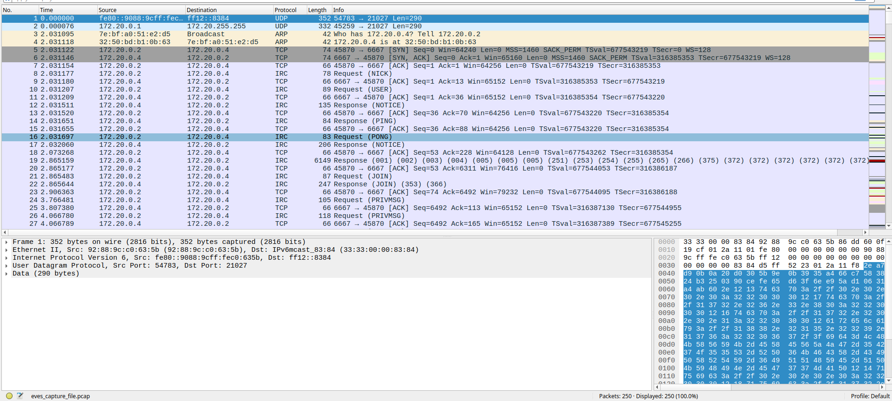
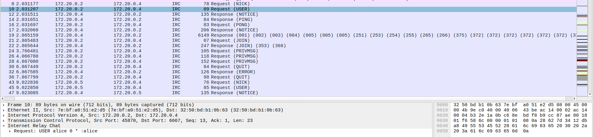
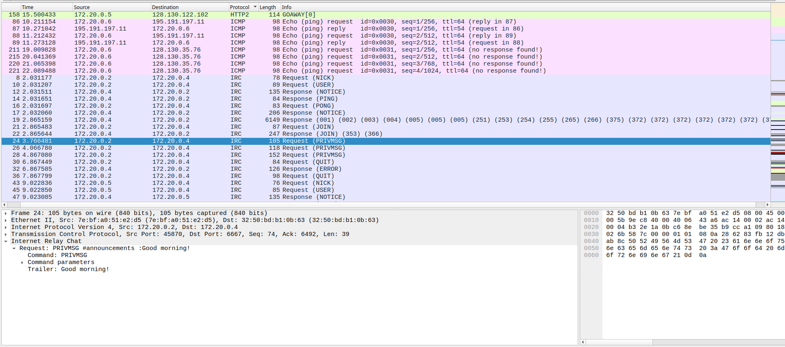
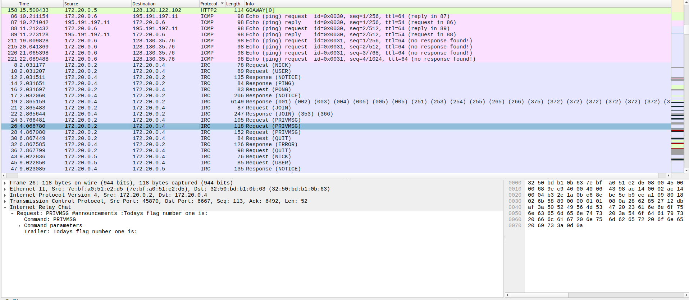
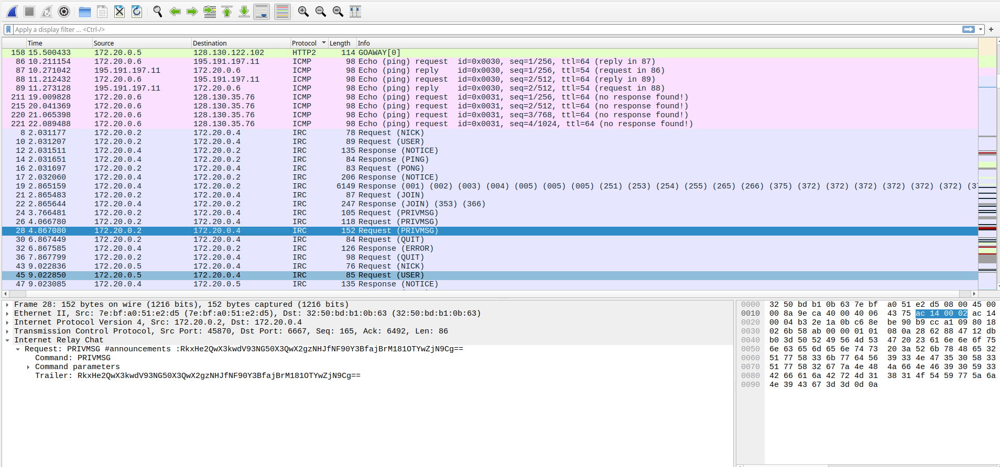

# PCAP Pt.1

## Introduction

In this challenge, we step into a classic network forensics scenario involving the famous cryptographic characters: Alice, Bob, Eve, and Mallory. We are provided with a file named `eves_capture_file.pcap`, which Eve has presumably captured from the network.

**What is a PCAP file?** A PCAP (Packet Capture) file is a standard file format used in network analysis to store traffic data. It contains a precise, chronological record of data packets intercepted from a network interface. Essentially, it is a digital "recording" of the conversations between computers — every request, every response, and every message sent over the wire is preserved in this file, allowing us to replay and inspect the traffic later.

The challenge description explicitly states that "The first flag is announced by Alice on IRC." This hint significantly narrows our search scope, pointing us toward the Internet Relay Chat (IRC) protocol. IRC is a simple text-based communication protocol that historically transmits messages in plaintext (unless wrapped in TLS), making it a prime target for eavesdropping. Since we have the raw packet data, we can simply reconstruct these TCP streams to read the chat logs as if we were part of the conversation.

## Tooling: Wireshark

To analyze the capture file, we use Wireshark, the industry-standard network protocol analyzer. Wireshark allows us to open PCAP files and inspect traffic at a microscopic level.

Key features we will utilize for this challenge include:

- **Display Filters:** To isolate specific protocols (like `irc`) from the noise of other network traffic.
- **Follow TCP Stream:** To reconstruct the full, human-readable conversation between the client (Alice) and the server.

## Initial Reconnaissance

Upon opening the capture file `eves_capture_file.pcap` in Wireshark, we are greeted with the standard packet list view. The interface provides a detailed chronological log of all captured network traffic.



### Wireshark Interface Analysis

The screenshot displays the fundamental columns of the packet list pane, which are essential for navigating the capture:

- **No. (Number):** The unique index number of each packet (e.g., packets 1–27 are visible).
- **Time:** The timestamp relative to the start of the capture.
- **Source / Destination:** The IP addresses of the sender and receiver. Here, we see communication primarily between `172.20.0.2` (Client) and `172.20.0.4` (Server).
- **Protocol:** The application-layer protocol. We can clearly see TCP and IRC packets, confirming the hint about IRC traffic.
- **Info:** A summary of the packet payload. This is where we see the actual IRC commands like `NICK`, `USER`, `JOIN`, and `PRIVMSG`.

### Tracing the IRC Handshake

The captured traffic perfectly illustrates a standard IRC connection sequence as defined in RFC 1459 and RFC 2812.

- **Connection Setup (Packets 5–7):** A standard TCP 3-way handshake (SYN, SYN-ACK, ACK) establishes the connection on port 6667.
- **Registration (Packets 8–11):** The client sends `NICK` (to set a nickname) and `USER` (to set username/realname). The server acknowledges this.
- **Ping/Pong (Packets 14–17):** The server sends a `PING` to check if the client is alive, and the client responds with `PONG`.
- **Joining a Channel (Packets 21–22):** The client sends a `JOIN` command to enter a chat room (channel).
- **Messaging (Packets 24–26):** Finally, we see `PRIVMSG` packets. In the IRC protocol, `PRIVMSG` is the command used to send actual text messages to a channel or user.

## Understanding the Protocol: IRC

### What is IRC?

Internet Relay Chat (IRC) is one of the earliest application-layer protocols for real-time internet text messaging. Defined by RFC 1459, it follows a client-server model where users connect to a central server to join channels (chat rooms) or send private messages.

Key characteristics relevant to this challenge include:

- **Plaintext by Default:** Historically, IRC sends all data unencrypted. This means usernames, passwords, and messages are visible to anyone capturing the traffic.
- **Command Structure:** All interactions are text commands. For example, `NICK` sets a nickname, `JOIN` enters a channel, and `PRIVMSG` sends a message.

### Grouping and Identification

To make sense of the traffic, we can click the Protocol column header in Wireshark to sort the packets. This groups all IRC packets together, separating them from the underlying TCP acknowledgments and ARP requests, giving us a clean view of the application logic.

### Identifying Alice

The challenge tells us to look for Alice. To find her, we inspect the initial IRC registration commands.



We focus on Packet 10, which is a `USER` request.

- **Source IP:** `172.20.0.2`
- **Destination IP:** `172.20.0.4`
- **Command Payload:** In the bottom pane, Wireshark dissects the packet content:

```
Request: USER alice 0 * :alice
```

This definitively confirms that the IP address `172.20.0.2` belongs to Alice. Any message originating from this IP (`172.20.0.2`) is a message sent by Alice, and any message destined to it is received by Alice. This IP-to-Identity mapping is crucial for filtering the conversation later.

## Extracting the Flag

Having identified Alice's IP address (`172.20.0.2`), we can now filter the traffic to focus specifically on her messages. The challenge states she "announces" the flag, so we look for `PRIVMSG` commands sent by her client.

Scanning the packet list, we find a sequence of three messages sent to the channel `#announcements`.

### 1. The Greeting

In Packet 24, Alice initiates the conversation.

- **Packet:** 24
- **Command:** `PRIVMSG #announcements :Good morning!`
- **Analysis:** This confirms Alice has successfully joined the channel and is active.



### 2. The Announcement

In Packet 26, Alice prepares the channel for the sensitive information.

- **Packet:** 26
- **Command:** `PRIVMSG #announcements :Todays flag number one is:`
- **Analysis:** This message is the explicit trigger mentioned in the challenge description. We know the very next message will contain the secret.


*Insert screenshot here: Wireshark view with Packet 26 selected, showing the "Todays flag number one is:" PRIVMSG in the packet details pane.*

### 3. The Payload

In Packet 28, Alice sends the final message in the sequence.

- **Packet:** 28



## Decoding the Flag

To reveal the flag, we must decode the Base64 string from Packet 28. This can be done using standard command-line tools or online services like [base64decode.org](https://www.base64decode.org/).

Decoding `RkxHe2QwX3kwdV93NG50X3QwX2gzNHJfNF90Y3BfajBrM181OTYwZjN9Cg==` yields:

```
FLG{d0_y0u_w4nt_t0_h34r_4_tcp_j0k3_5960f3}
```

This confirms the first flag, hidden in plain sight behind a simple Base64 encoding on an otherwise plaintext IRC channel — a fitting reminder that IRC offers no confidentiality on its own, and that "encoding" is not the same as "encryption."
