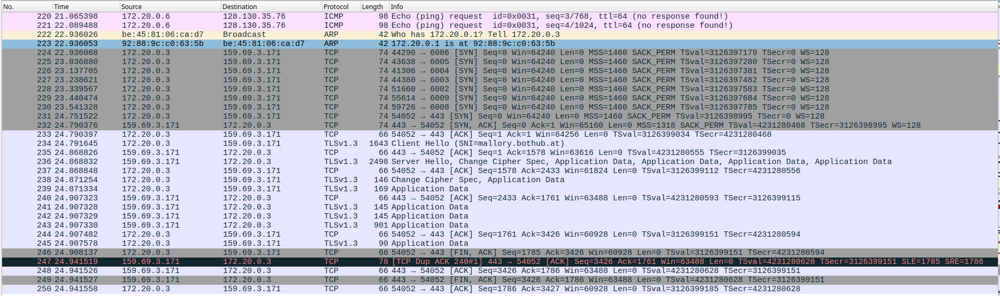

# PCAP Pt.3

## Introduction

We have reached the final part of the network analysis challenge, pcap pt3. The objective is to retrieve the last flag, which belongs to Mallory. According to the challenge description, Mallory hosts a website for her flags, but it appears to be "down" for everyone else.

The description explicitly states "firewall says no" and notes that Mallory claims "it works for her". This suggests the web server is actually running but is protected by a firewall rule that filters traffic based on specific criteria (likely IP address or source network), allowing only Mallory to access it. Our goal is to analyze the captured traffic to understand how she connects and bypass this restriction.

## Following Mallory's Traffic

In the capture, Mallory initiates a TLS connection to `mallory.botuhb.at` (`159.69.3.171:443`), and the content again appears largely as TLSv1.3 "Application Data" (i.e., encrypted payload).

### Previous Key Doesn't Apply

This indicates that the key material recovered in the previous part does not decrypt Mallory's website session, because TLS secrets are bound to a specific session/connection and can't be reused to decrypt unrelated TLS streams.

### Searching for More Secrets (No Success)

At this point, a reasonable next attempt is to scan the PCAP for other leaked secrets (e.g., another transmitted key log, Base64 blobs, or plaintext credentials). However, this does not reveal any additional usable key material, so the investigation must pivot toward understanding what makes Mallory's access succeed (rather than relying on another direct key leak).

### Suspicious Pattern: Multiple Connection Attempts

Looking closely, we notice something unusual: Mallory's machine (`172.20.0.3`) connects to the server IP (`159.69.3.171`) on multiple different ports in rapid succession before finally establishing the HTTPS session on port 443. These appear as short-lived TCP connections that are quickly acknowledged and closed.



This behavior is consistent with a technique called **port knocking**, which is a method of obscuring service access by requiring clients to connect to a predefined sequence of ports before the firewall allows access to the actual service. A monitoring program on the server watches connection attempts and, once the correct "knock sequence" is detected from a source IP, dynamically opens the firewall rule to permit traffic from that address.

Port knocking provides a layer of obfuscation: even if a service like HTTPS is running, it remains invisible to unauthorized users because the firewall blocks it by default. Only after the correct port sequence is triggered does the server grant access.

Since we can see the exact ports Mallory contacted before successfully accessing the website, the solution is to reproduce that same knock sequence from our own machine, which should cause the firewall to temporarily allow our connection to port 443 and reveal the flag.

## Port-Knock Script (Linux)

To reproduce Mallory's access pattern, a small Bash script was used on a Linux machine to send the same knock sequence to the server before connecting over HTTPS.

```bash
#!/usr/bin/env bash

IP="159.69.3.171"

PORTS=(6006 6005 6004 6003 6002 6009 6008)

echo "[*] Starting knock sequence on $IP ..."

for p in "${PORTS[@]}"; do
  echo "[*] Knocking on port $p ..."
  # -z = just scan / no data, -w 0.1 = short timeout so it doesn't hang
  nc -z -w 0.1 "$IP" "$p" >/dev/null 2>&1
done

echo "[*] Knock sequence done. Opening HTTPS on port 443 ..."

# Open URL in default browser (Linux desktop)
xdg-open "https://$IP:443/" >/dev/null 2>&1 &
```

### How the Script Works

- The `IP` variable stores Mallory's web server address `159.69.3.171`, which is where the port knocking and later HTTPS request are sent.
- The `PORTS` array encodes the exact knock sequence seen in the PCAP: `6006 6005 6004 6003 6002 6009 6008`. The order matters, because the firewall only opens 443 when this sequence is observed from the same client IP.
- The `for` loop iterates over each port in `PORTS`. For every element `p`, it calls `nc` (netcat) with `-z` (do not send data, just attempt a connection) and `-w 0.1` (short timeout so the script doesn't hang on closed ports). All output is redirected to `/dev/null` so the user only sees the status echoes.
- These rapid, connection-only probes emulate the port-knocking behavior that Mallory's host exhibits in the capture and trigger the firewall daemon to temporarily allow access to TCP port 443 for the caller's IP.
- After the loop finishes, the script uses `xdg-open "https://$IP:443/"` to open the HTTPS URL in the default desktop browser on Linux, again silencing terminal output and running it in the background.

Running this script sends the correct knock sequence and then automatically opens Mallory's HTTPS site in the default browser, where the final flag becomes visible.

## References

- Network Security 2 Lecture — Slide 29
